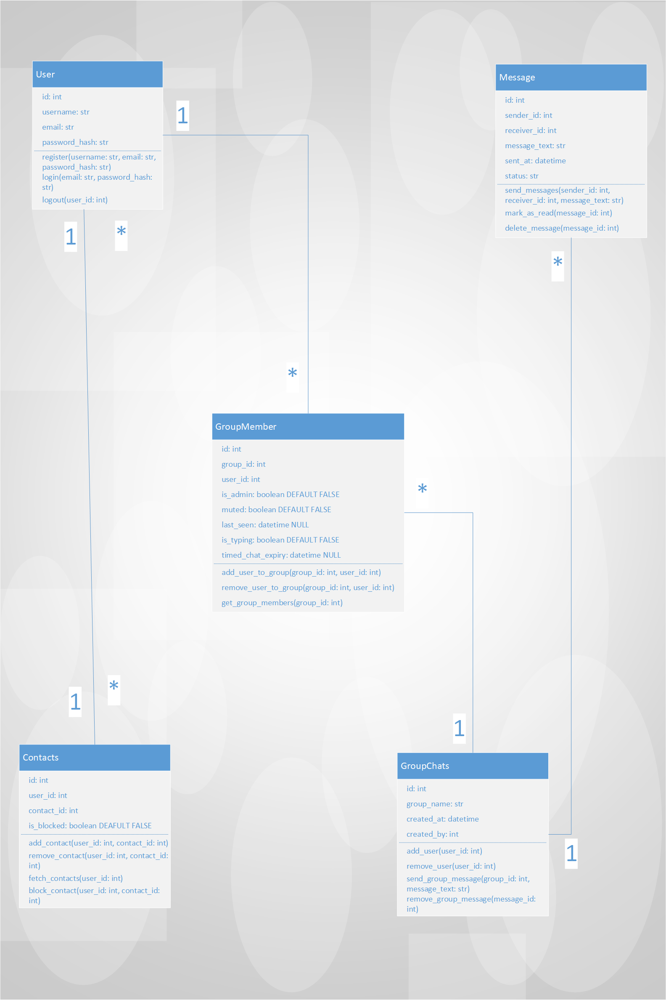

<h1>Activity Diagram</h1>

The WebSocket Activity Diagram 

Detailed Explanation:
- When a user logs in, a WebSocket connection is established
- The message is sent via WebSocket and stored in the database
- If the recipient is online, the message is delivered instantly
- If the recipient is offline, the message is stored and sent upon reconnection

 

<h1>Sequence Diagram</h1>

The REST API Sequence Diagram illustrates how a user interacts with the Flask Chat Application, showing the step-by-step communication flow between:
1. User (Client)
2. Flask REST API
3. Database (MySQL or other storage)

Detailed Explanation: 

This diagram tracks key API calls, including user authentication, message retrieval, message sending, and contact list fetching. It helps developers understand how data moves between the client, backend, and database.

<h1>Class Diagram</h1>

This class diagram models the core components of the chat application, defining their attributes, methods, and relationships.

Detailed Explanation: 

The system supports:

User registration and authentication 

One-to-One messaging and group chats

Timed private chats (self-deleting after expiration)

Contact management (adding, blocking, fetching contacts)

Group membership management (roles, notifications, activity tracking)

